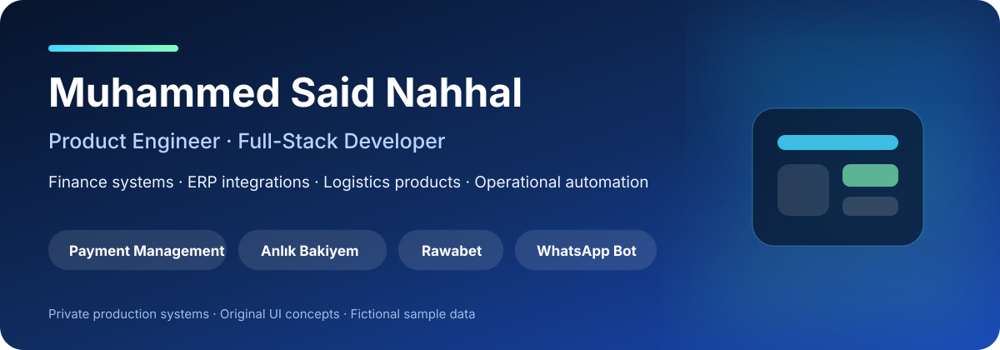
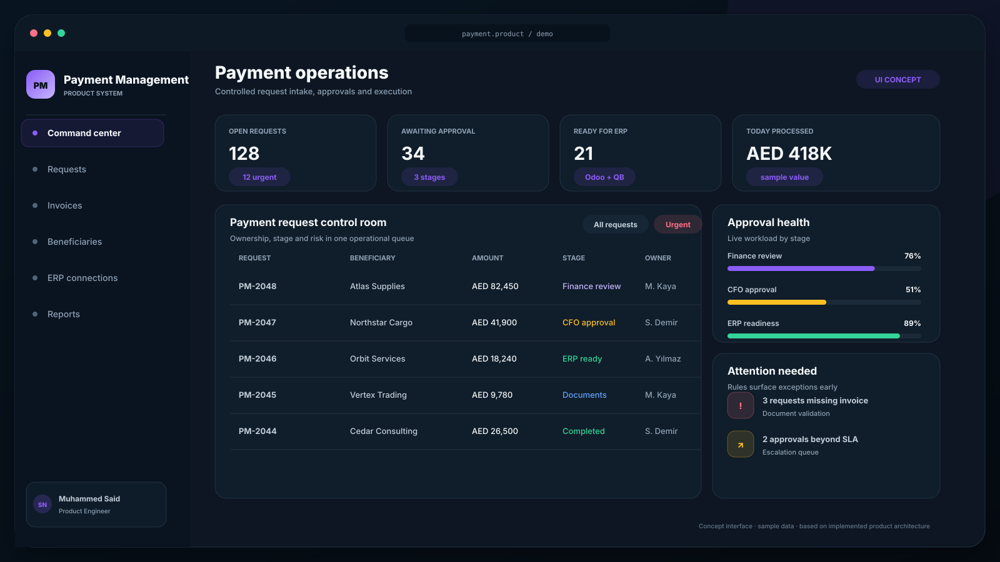
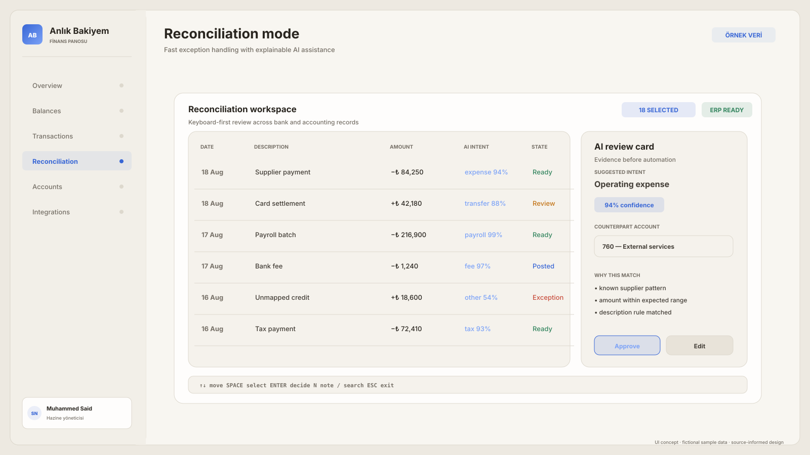
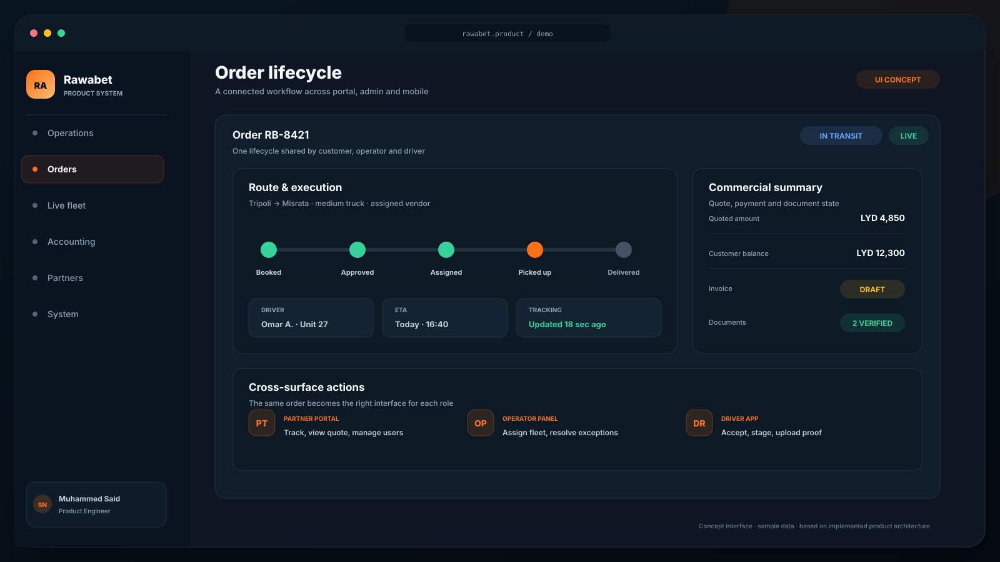
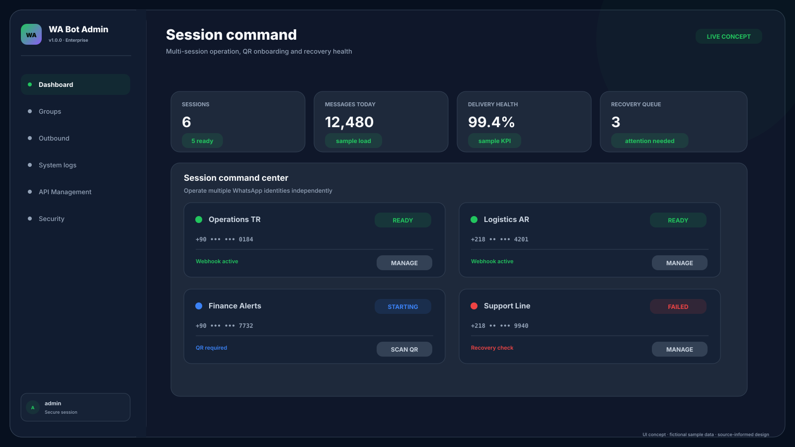

  

  <a href="README.tr.md">Türkçe</a> ·
  <a href="https://www.linkedin.com/in/muhammed-said-nahhal-171195267/">LinkedIn</a> ·
  <a href="https://github.com/saidoarici">GitHub</a>

I design and build business-critical products at the intersection of **finance, logistics, integrations, and operational automation**. My work spans product discovery, UX architecture, backend systems, web and mobile interfaces, security, deployment, and production operations.

This portfolio presents four private commercial systems through original interface concepts based on their implemented product architecture. The visuals use fictional sample data; no production screenshots, credentials, customer records, phone numbers, or financial information are published.

## Product portfolio

| Product | Problem space | Product surfaces | Case study |
|---|---|---|---|
| **Payment Management** | Payment intake, approvals, evidence, and ERP posting | Finance workspace · admin · reporting · integrations | [Explore →](projects/payment-management.md) |
| **Anlık Bakiyem** | Multi-bank visibility and reconciliation | Treasury web app · bank connectors · ERP/accounting integrations | [Explore →](projects/anlik-bakiyem.md) |
| **Rawabet** | End-to-end logistics operations | Operator panel · partner portal · driver mobile app | [Explore →](projects/rawabet.md) |
| **WhatsApp Bot** | Reliable multi-session business messaging | Admin console · API · queues · security controls | [Explore →](projects/whatsapp-bot.md) |

## Payment Management

An enterprise payment operations platform that turns requests, invoices, approvals, beneficiaries, cash movements, and accounting hand-offs into one controlled workflow.

`Approval workflows` · `Invoice/OCR context` · `Odoo` · `QuickBooks` · `AI reporting` · `Audit trail`

[View four product demos and the complete case study →](projects/payment-management.md)

## Anlık Bakiyem

A multi-company treasury and reconciliation product that consolidates bank balances and transactions, then connects them to accounting workflows with scoped access and explainable review tools.

`Multi-bank aggregation` · `Reconciliation` · `Transaction cache` · `Odoo` · `QuickBooks` · `RBAC + audit`

[View four product demos and the complete case study →](projects/anlik-bakiyem.md)

## Rawabet

An end-to-end logistics product connecting partner orders, operator planning, fleet execution, live driver tracking, billing, and operational reporting across web and mobile surfaces.

`Admin operations` · `Partner portal` · `Driver app` · `Live tracking` · `Accounting` · `EN/AR workflows`

[View four product demos and the complete case study →](projects/rawabet.md)

## WhatsApp Bot — standalone platform

A standalone enterprise messaging gateway—not a Rawabet module. It manages multiple WhatsApp sessions, QR onboarding, group discovery, scoped API keys, outbound queues, recovery, audit logs, and network controls. Rawabet is one possible API client.

`Multi-session runtime` · `Outbound recovery` · `API keys` · `Per-session permissions` · `IP allowlists` · `Audit logs`

[View four product demos and the complete case study →](projects/whatsapp-bot.md)

## What I own across the product lifecycle

- Turn operational and financial problems into product requirements and safe workflows.
- Design service boundaries, APIs, data models, permissions, auditability, and failure recovery.
- Build backend, web, and mobile interfaces around real user roles and decisions.
- Integrate banking, ERP, accounting, maps, messaging, and background services.
- Test, containerize, deploy, monitor, and improve production systems.

## Core toolkit

`Python` · `FastAPI` · `Flask` · `React` · `React Native` · `TypeScript` · `MongoDB` · `SQLAlchemy` · `Redis` · `REST APIs` · `Socket.IO` · `Docker` · `Nginx` · `Linux` · `Odoo` · `QuickBooks` · `Mapbox`

## Contact

For product engineering, finance automation, ERP integration, logistics, or operational software work, connect with me on [LinkedIn](https://www.linkedin.com/in/muhammed-said-nahhal-171195267/).
