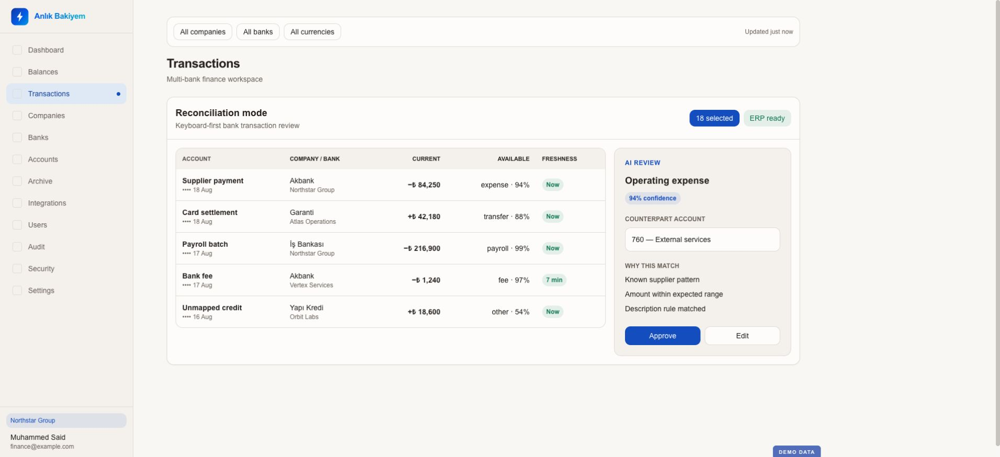
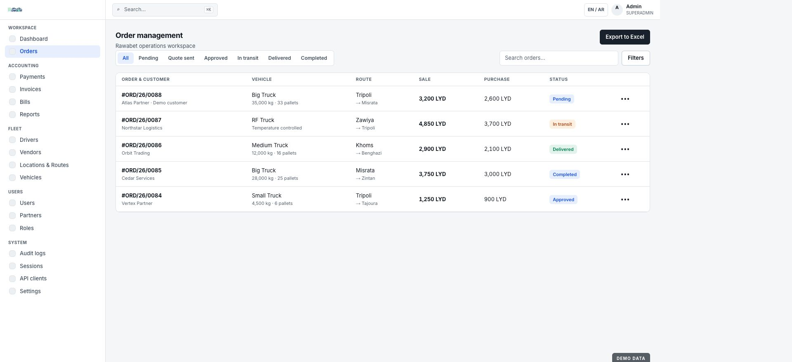
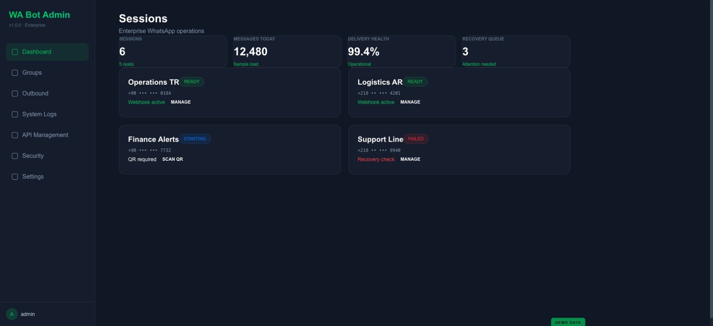

  

  <a href="README.md">English</a> ·
  <a href="https://www.linkedin.com/in/muhammed-said-nahhal-171195267/">LinkedIn</a> ·
  <a href="https://github.com/saidoarici">GitHub</a>

**Finans, lojistik, entegrasyon ve operasyonel otomasyon** kesişiminde iş açısından kritik ürünler tasarlıyor ve geliştiriyorum. Ürün keşfinden UX mimarisine; backend sistemlerinden web ve mobil arayüzlere; güvenlikten dağıtım ve canlı operasyona kadar ürünün tamamında çalışıyorum.

Bu portföy, dört private ticari sistemi gerçek tasarım sistemleri ve sayfa yapılarından üretilmiş ürüne özgü demo görselleriyle anlatır. Görsellerde yalnızca kurgusal örnek veriler kullanılmıştır; üretim ekran görüntüleri, müşteri kayıtları, telefon numaraları, finansal bilgiler ve erişim bilgileri yayımlanmamıştır.

## Ürün portföyü

| Ürün | Çözdüğü problem | Ürün yüzeyleri | Vaka çalışması |
|---|---|---|---|
| **Payment Management** | Ödeme talebi, onay, belge ve ERP aktarımı | Finans çalışma alanı · yönetim · raporlama · entegrasyon | [İncele →](projects/payment-management.md) |
| **Anlık Bakiyem** | Çoklu banka görünürlüğü ve mutabakat | Hazine web uygulaması · banka bağlantıları · ERP/muhasebe | [İncele →](projects/anlik-bakiyem.md) |
| **Rawabet** | Uçtan uca lojistik operasyonu | Operatör paneli · partner portalı · sürücü mobil uygulaması | [İncele →](projects/rawabet.md) |
| **WhatsApp Bot** | Güvenilir, çok oturumlu kurumsal mesajlaşma | Yönetim konsolu · API · kuyruklar · güvenlik | [İncele →](projects/whatsapp-bot.md) |

## Payment Management

Ödeme taleplerini, faturaları, onayları, hak sahiplerini, nakit hareketlerini ve muhasebe aktarımını tek bir kontrollü iş akışına dönüştüren kurumsal finans operasyon platformu.

`Onay akışları` · `Fatura/OCR bağlamı` · `Odoo` · `QuickBooks` · `AI raporlama` · `Denetim izi`

[Dört ürün demosunu ve ayrıntılı vaka çalışmasını gör →](projects/payment-management.md)

## Anlık Bakiyem

Banka bakiyelerini ve hareketlerini şirket bazında bir araya getiren; muhasebe süreçlerine yetki kapsamı ve açıklanabilir inceleme araçlarıyla bağlayan hazine ve mutabakat ürünü.

`Çoklu banka` · `Mutabakat` · `İşlem önbelleği` · `Odoo` · `QuickBooks` · `RBAC + audit`

[Dört ürün demosunu ve ayrıntılı vaka çalışmasını gör →](projects/anlik-bakiyem.md)

## Rawabet

Partner siparişlerini, operatör planlamasını, filo icrasını, canlı sürücü takibini, faturalamayı ve raporlamayı web ve mobil yüzeylerde birleştiren uçtan uca lojistik ürünü.

`Operasyon paneli` · `Partner portalı` · `Sürücü uygulaması` · `Canlı takip` · `Muhasebe` · `EN/AR akışlar`

[Dört ürün demosunu ve ayrıntılı vaka çalışmasını gör →](projects/rawabet.md)

## WhatsApp Bot — bağımsız platform

Rawabet’ın içinde bir modül değil, bağımsız bir kurumsal mesajlaşma geçididir. Çoklu WhatsApp oturumlarını, QR bağlantısını, grup keşfini, kapsamlı API anahtarlarını, gönderim kuyruklarını, kurtarma akışlarını, audit kayıtlarını ve ağ erişim kurallarını yönetir. Rawabet bu platformun olası API istemcilerinden yalnızca biridir.

`Çoklu oturum` · `Gönderim kurtarma` · `API anahtarları` · `Oturum bazlı izinler` · `IP allowlist` · `Audit logları`

[Dört ürün demosunu ve ayrıntılı vaka çalışmasını gör →](projects/whatsapp-bot.md)

## Ürün yaşam döngüsündeki katkım

- Operasyon ve finans problemlerini ürün gereksinimlerine ve güvenli iş akışlarına dönüştürmek.
- Servis sınırlarını, API’leri, veri modellerini, yetkileri, denetim izini ve hata kurtarmayı tasarlamak.
- Gerçek kullanıcı rolleri ve kararları etrafında backend, web ve mobil arayüzler geliştirmek.
- Banka, ERP, muhasebe, harita, mesajlaşma ve arka plan servislerini entegre etmek.
- Sistemleri test etmek, container hâline getirmek, yayımlamak, izlemek ve iyileştirmek.

## Teknoloji seti

`Python` · `FastAPI` · `Flask` · `React` · `React Native` · `TypeScript` · `MongoDB` · `SQLAlchemy` · `Redis` · `REST APIs` · `Socket.IO` · `Docker` · `Nginx` · `Linux` · `Odoo` · `QuickBooks` · `Mapbox`

## İletişim

Ürün geliştirme, finans otomasyonu, ERP entegrasyonu, lojistik veya operasyon yazılımları için [LinkedIn](https://www.linkedin.com/in/muhammed-said-nahhal-171195267/) üzerinden iletişime geçebilirsiniz.
