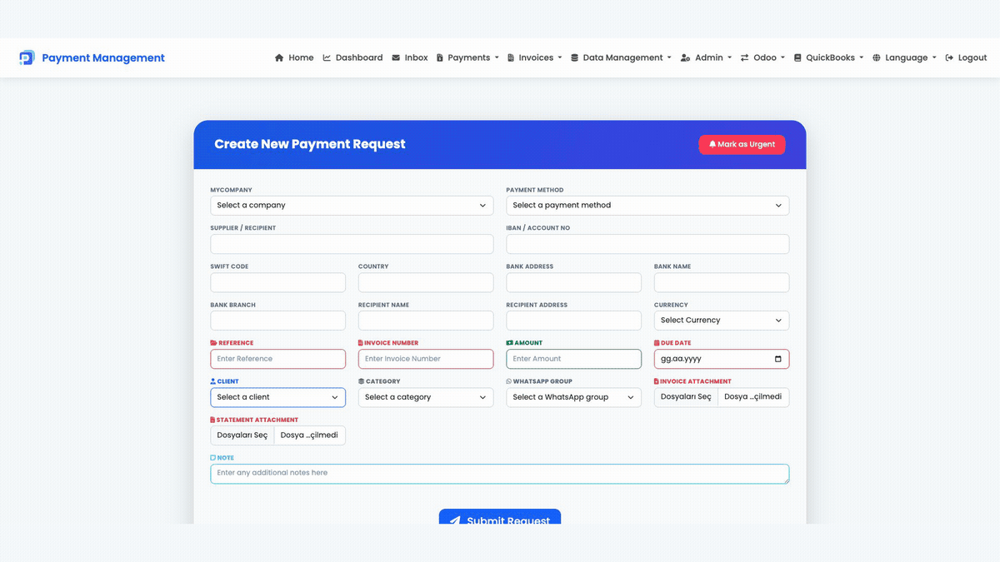
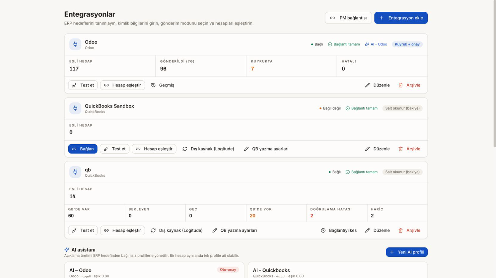
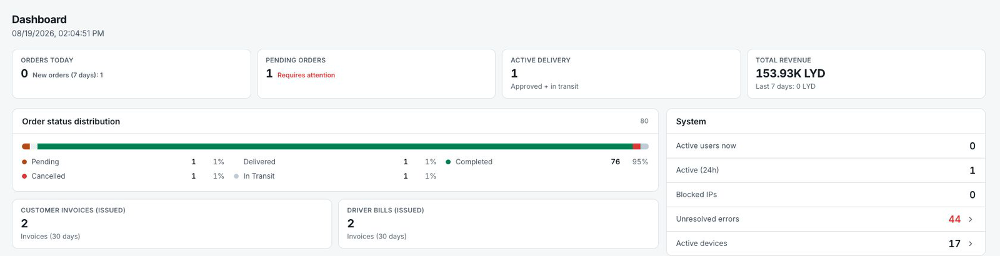
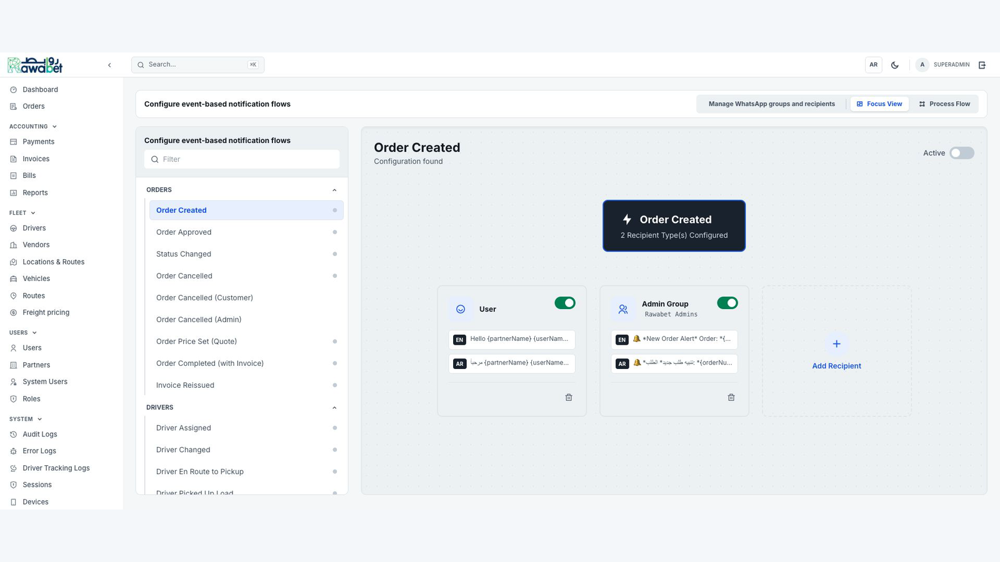

  

  <a href="README.md">English</a> ·
  <a href="https://www.linkedin.com/in/muhammed-said-nahhal-171195267/">LinkedIn</a> ·
  <a href="https://github.com/saidoarici">GitHub</a>

Finans, lojistik, ERP entegrasyonları ve operasyon otomasyonu alanlarında üretim ortamında çalışan yazılımlar geliştiriyorum. İş analizi, ürün kararları, sistem mimarisi, API geliştirme, arayüz, test, deployment ve canlı operasyon süreçlerini uçtan uca yönetiyorum.

  

> Bu projeler ticari ve özel sistemlerdir. Görseller boş formlar, sandbox verileri veya güvenli yapılandırma ekranlarından hazırlanmıştır. Kaynak kodu, erişim bilgileri, müşteri kayıtları, hesap numaraları ve üretim finans verileri paylaşılmamaktadır.

## Öne çıkan sistemler

### Payment Management

Ödeme taleplerini, çok aşamalı onayları, belgeleri, finansal kayıtları ve ERP entegrasyonlarını tek ve kontrollü bir iş akışında birleştiren kurumsal uygulama.

**Odak:** finans otomasyonu · onay akışları · Odoo ve QuickBooks entegrasyonu · belge yönetimi · denetlenebilirlik

[Detaylı inceleme →](projects/payment-management.md)

### Anlık Bakiyem

Banka, Odoo ve QuickBooks verilerini birleştiren finansal görünürlük ve mutabakat platformu. Bakiyeleri ve hareketleri standartlaştırır, farkları belirler ve finans ekiplerine güncel bir operasyon görünümü sunar.

**Odak:** banka bağlantıları · ERP mutabakatı · hesap eşleştirme · raporlama · salt-okunur yapay zekâ bağlantıları

[Detaylı inceleme →](projects/anlik-bakiyem.md)

### Rawabet

Sipariş, teklif, taşıma, teslimat, ödeme, fatura, sürücü, araç, rota ve operasyonel raporlama süreçlerini birleştiren uçtan uca lojistik platformu.

**Temel teknoloji yığını:** FastAPI · React · MongoDB · Docker · Mapbox · REST API

[Detaylı inceleme →](projects/rawabet.md)

### Olay Tabanlı WhatsApp Bot

Rawabet’e bağlı yapılandırılabilir bildirim motoru. Operasyon olaylarına göre iki dilli şablonları seçer, kullanıcı veya yönetici alıcılarını belirler ve sipariş yaşam döngüsü boyunca uygun WhatsApp akışını tetikler.

**Odak:** olay tabanlı otomasyon · Türkçe/İngilizce/Arapça akışlar · alıcı yönlendirme · operasyon bildirimleri

[Detaylı inceleme →](projects/whatsapp-bot.md)

## Çalışma yaklaşımım

- Finans ve operasyon sorunlarını açık ürün ve sistem gereksinimlerine dönüştürürüm.
- API, veri modeli, yetkilendirme, denetim kaydı ve entegrasyon mimarilerini tasarlarım.
- Backend, frontend ve altyapı süreçlerini birlikte geliştirir ve test ederim.
- Docker, Nginx, Linux, izleme ve yapılandırılmış loglarla canlı sistemleri yönetirim.
- Yapay zekâ destekli geliştirme araçlarını; mimari, doğrulama ve ürün kararlarını insan kontrolünde tutarak kullanırım.

## Temel araçlar

`Python` · `FastAPI` · `React` · `MongoDB` · `REST API` · `Docker` · `Nginx` · `Linux` · `Git` · `Odoo` · `QuickBooks` · `Mapbox`

