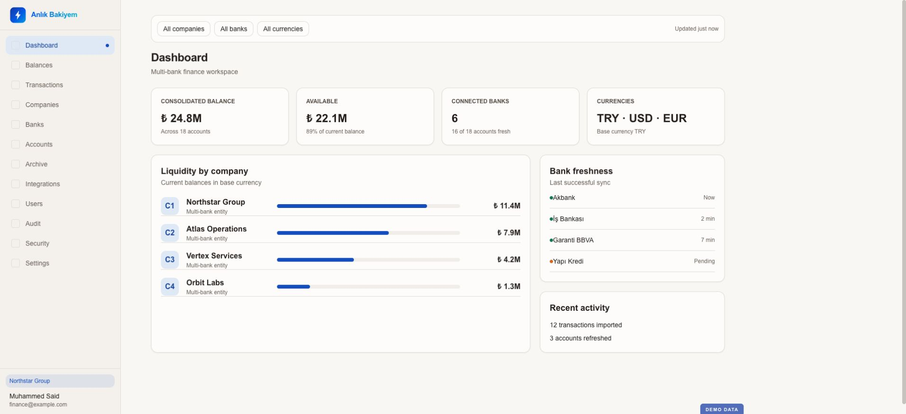
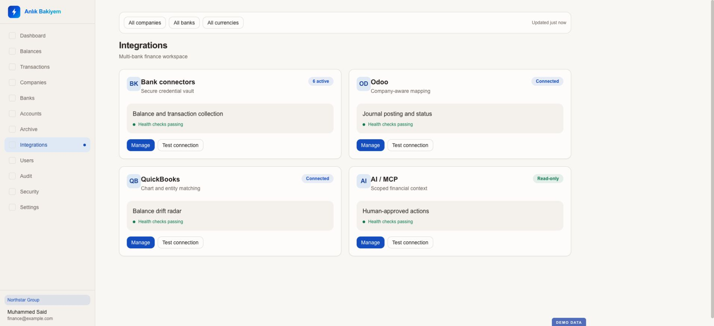
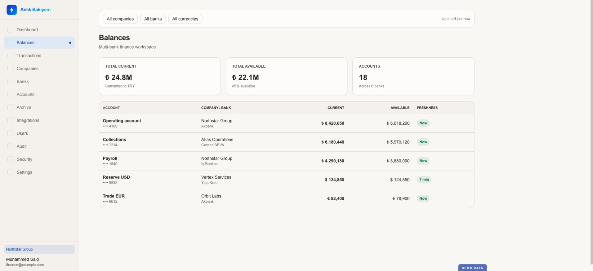
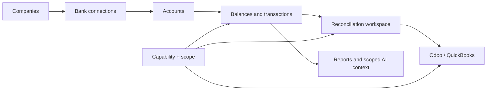

# Anlık Bakiyem

[← Portfolio](../README.md)

A multi-company treasury, bank visibility, and reconciliation platform built to give finance teams a current operational picture without losing account scope, auditability, or accounting context.

> The interfaces below are safe demo renders built from the product's implemented design system and page structures. All institutions, companies, balances, and transactions are fictional sample data.

## 01 — Treasury overview

The overview consolidates balances across companies, banks, accounts, and currencies while keeping data freshness visible. It is designed for scan speed: current position first, connectivity risk second, and the next required action third.

## 02 — Reconciliation mode

The reconciliation surface is an operational tool, not a passive table. It supports selection, notes, processed state, keyboard shortcuts, account mapping, Odoo and QuickBooks actions, AI-generated drafts, grouped review, exceptions, and balance-drift investigation.

## 03 — Integration hub

Bank, Odoo, QuickBooks, and read-only AI/MCP connectors are presented as controlled targets with health, scope, and purpose. Credentials and tenant context remain part of the product model rather than hidden configuration.

## 04 — Balance workspace

The balance workspace keeps company, bank, account, currency, current value, and freshness context together in the same compact financial interface. Security and governance remain enforced across this surface through capability and account scope.

## Product surface

### Treasury and banking

- Company, bank connection, account, balance, and transaction management
- Multi-bank and multi-company views with currency-aware values
- Account imports, archives, date ranges, saved filters, and transaction detail
- Transaction caching and coverage controls for responsive reporting

### Reconciliation and accounting

- Processed/unprocessed states, bulk selection, notes, and exception workflows
- Odoo posting, exclusion, requeue, account mapping, and target-aware controls
- QuickBooks status radar, candidates, linking, reclassification, undo, and balance checks
- AI-assisted intent drafts, confidence, grouping, safe approval, and exception focus

### Platform and governance

- Multi-tenant organization boundary
- Capability-based authorization combined with company/account scope
- Audit records, 2FA, recovery codes, password controls, and session revocation
- English, Turkish, and Arabic localization with RTL support
- Public product site, authenticated admin application, and mobile application surface

## System shape

The implementation uses a FastAPI backend, MongoDB/Beanie data layer, React/Vite/TypeScript frontend, Redis-backed worker processes, scheduled collection, secure credential handling, and bank/accounting connectors.

## Product engineering contribution

Product architecture, financial workflow design, backend and frontend development, bank and ERP connectivity, multi-tenant permissions, reconciliation UX, localization, testing, deployment, and operations.

## What this case study demonstrates

- Turning many bank-specific sources into a coherent treasury model
- Designing dense financial interfaces for scan speed and controlled action
- Combining capability and data scope instead of relying on role names alone
- Using AI as explainable assistance inside a human-controlled workflow
