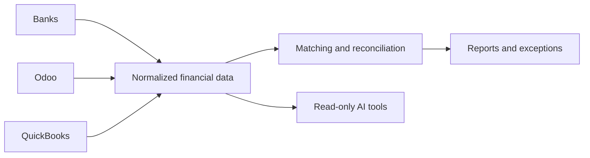

# Anlık Bakiyem

## Overview

Anlık Bakiyem combines balances and transactions from banks, Odoo, and QuickBooks to give finance teams a current, reconciled operational view. It reduces repetitive manual comparison and makes mismatches easier to detect and investigate.

## Product capabilities

- Multi-company and multi-account balance visibility
- Bank transaction retrieval and normalized reporting
- Odoo and QuickBooks account matching
- Queue, verification, mismatch, and exception monitoring
- Reconciliation-oriented transaction views and exports
- Audit, user, security, archive, and integration management
- Read-only AI connector profiles for natural-language account queries

## My contribution

Product analysis, integration architecture, API development, account-matching workflows, interface development, testing, deployment, and operational support.

> Private commercial system. The screenshot is limited to a configuration view and excludes credentials, account numbers, balances, and transactions.

