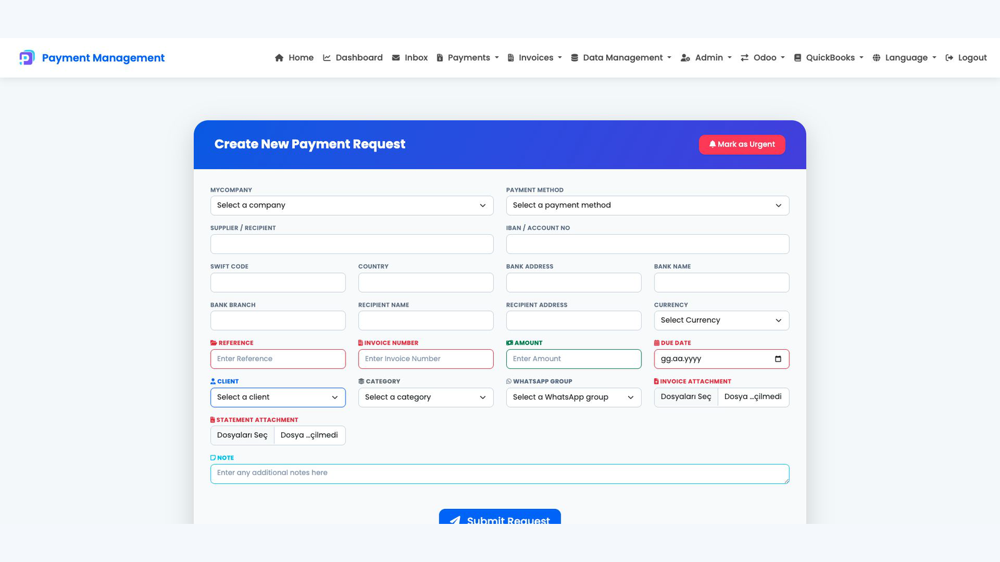
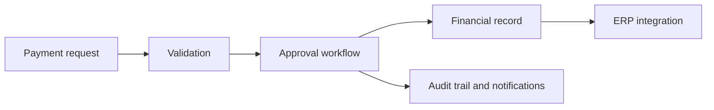

# Payment Management

## Overview

Payment Management centralizes payment requests, supporting documents, approval decisions, and ERP-related financial records. The goal is to replace fragmented email and spreadsheet processes with a controlled, traceable workflow.

## Product capabilities

- Structured payment and cash request creation
- Multi-stage approval and urgency handling
- Beneficiary, bank, invoice, reference, and attachment management
- Request status, archive, inbox, and reporting views
- Odoo and QuickBooks integration surfaces
- Role-based administration, activity logs, and configurable menus
- Optional WhatsApp group routing for operational notifications

## My contribution

Business analysis, product decisions, workflow design, backend and interface development, ERP integration, testing, deployment, and live operations.

> Private commercial system. The screenshot shows an empty form and contains no customer or financial records.

