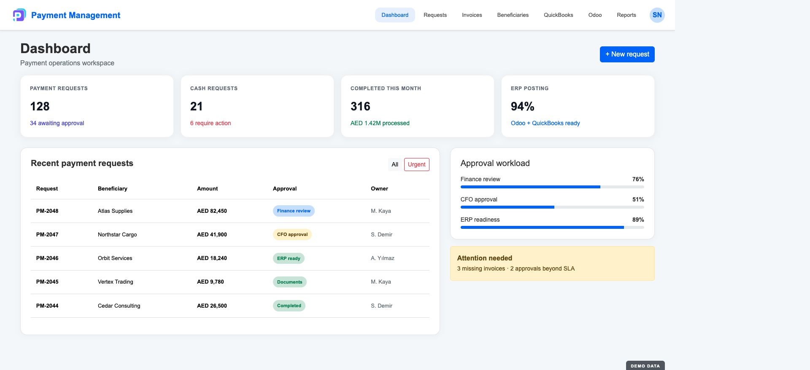
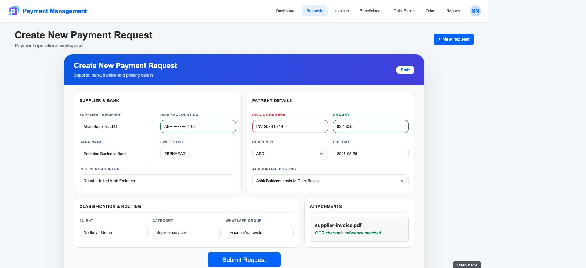
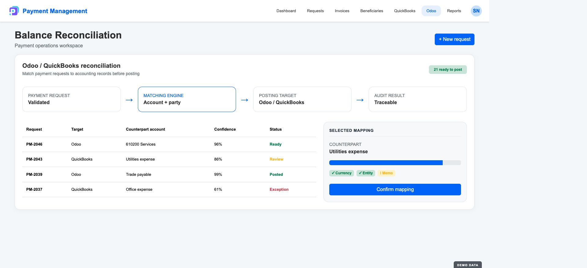
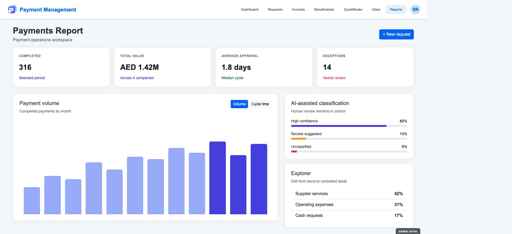
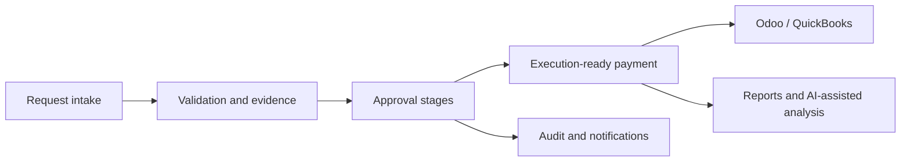

# Payment Management

[← Portfolio](../README.md)

An enterprise finance operations product for turning payment requests, supporting evidence, approvals, and accounting hand-offs into one controlled and traceable workflow.

> The interfaces below are safe demo renders built from Payment Management's implemented templates, CSS, page structures, workflows, and integrations. All names, identifiers, and amounts are fictional sample data.

## 01 — Operations command center

The opening view is designed around operational decisions: what is open, where requests are waiting, which items need attention, and what is ready for an accounting system. It replaces a generic dashboard with a queue that exposes ownership, approval stage, urgency, and readiness.

## 02 — Approval workspace

A payment request is more than a form. The decision surface combines beneficiary and bank details, invoice references, attachments, OCR context, category, amount, policy checks, approval history, and the next authorized action.

## 03 — ERP reconciliation

The accounting hand-off makes validation and mapping visible before posting. Odoo and QuickBooks surfaces cover accounts, transactions, balances, entity matching, expense creation, reconciliation, and posting outcomes without hiding exceptions behind automation.

## 04 — Finance intelligence

Reporting moves from static export to investigation: completed-payment exports, grouped summaries, AI-assisted classification, streaming analysis, explorer views, and controlled drill-down into the underlying payment population.

## Product surface

### Request and approval operations

- Payment and cash request creation, editing, status tracking, archiving, and deletion
- Multi-stage decision workflow, urgency, ownership, and approval visibility
- Beneficiary, client, company, bank, category, and service-type management
- Attachments, invoice upload, invoice references, instruction templates, and evidence handling
- QR-based approval and courier/receipt workflows

### Finance and integrations

- Odoo connection, account access, transaction views, and balance reconciliation
- QuickBooks invoices, customers, entity matching, accounts, expenses, and balance refresh
- Bank links, IBAN validation, financial records, and controlled external API access
- Excel conversion, rule management, import/export, and standardized column processing

### Intelligence and control

- Completed-payment reporting and export
- AI-assisted classification, explorer, streaming analysis, and drill-down
- Email inbox processing and attachment handling
- Role-aware administration, event logs, configurable menus, and notifications

## System shape

The current implementation combines a Python/Flask application, SQLAlchemy-backed data, server-rendered operational interfaces, background integrations, and route groups for reporting, messaging, documents, and external access.

## Product engineering contribution

Business workflow analysis, product decisions, data and route design, finance interface development, ERP/accounting integration, automation, testing, deployment, and live operational improvement.

## What this case study demonstrates

- Converting fragmented finance work into an explicit product workflow
- Designing decision surfaces around evidence and authorization
- Keeping ERP automation observable and recoverable
- Creating reporting that supports both overview and investigation
