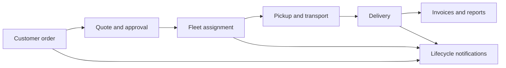

# Rawabet

## Overview

Rawabet is an end-to-end logistics and digital services platform designed for the Libyan market. It connects customer orders with operational planning, fleet execution, delivery tracking, accounting, and multilingual communication.

## Product capabilities

- Order, quote, transport, delivery, and completion workflows
- Driver, vendor, vehicle, route, location, and freight pricing management
- Payments, customer invoices, supplier bills, and accounting reports
- Role-based access, audit logs, sessions, devices, and API clients
- Map and location services powered by Mapbox
- English and Arabic administration flows
- Push and WhatsApp notification automation

## Core stack

FastAPI · React · MongoDB · Docker · Mapbox · REST APIs

## My contribution

Backend development, system architecture, map and location services, user flows, server setup, testing, deployment, and product development.

> The dashboard screenshot comes from a local sandbox environment. Customer and phone-number tables are intentionally excluded.

