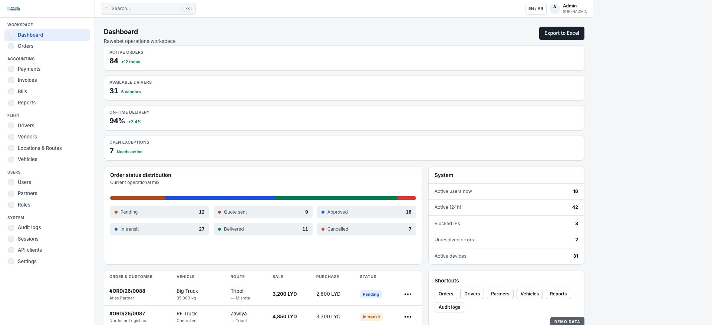
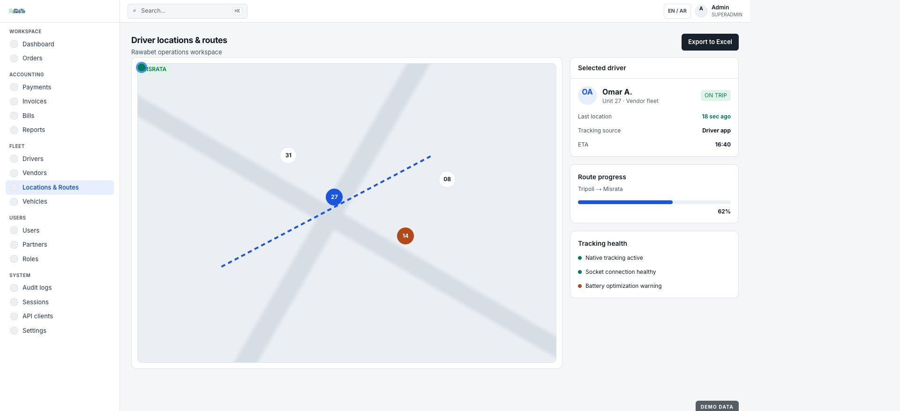
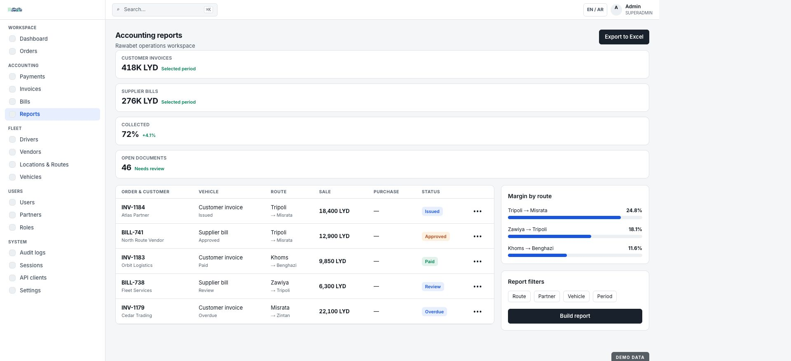
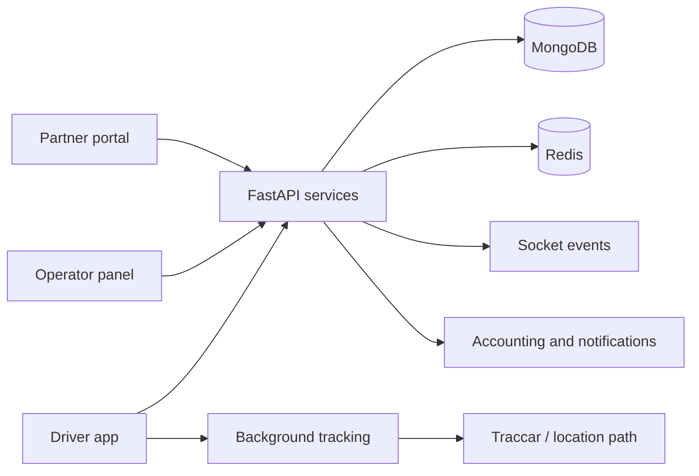

# Rawabet

[← Portfolio](../README.md)

An end-to-end logistics platform connecting partner demand, operator planning, driver execution, live location, commercial documents, and operational reporting.

> The interfaces below are safe demo renders built from Rawabet's implemented admin design system and page structures. All orders, parties, locations, and values are fictional sample data.

## 01 — Operations command

Operators need a shared view of orders, available capacity, active trips, route progress, and service exceptions. The command center prioritizes decisions and risk rather than presenting disconnected module counts.

## 02 — Order management workspace

The operator workspace exposes status stages, customer context, vehicle requirements, route, sale, purchase, and action controls in one dense table. The same order remains the shared lifecycle authority for partner tracking and driver execution.

## 03 — Fleet intelligence

Fleet visibility combines map position, route progress, assignment, ETA, and device health. The driver app includes background location behavior and the platform connects real-time socket updates with tracking infrastructure.

## 04 — Accounting and reporting

Orders do not stop at delivery. Payments, customer invoices, supplier bills, balances, and route-level reporting connect operational execution to commercial outcomes.

## Product surfaces

### Operator panel

- Dashboard and order administration
- Payments, customer invoices, supplier bills, and accounting reports
- Drivers, vendors, live locations, vehicles, city routes, and freight pricing
- Partners, users, system users, roles, permissions, and sessions
- WhatsApp/push configuration, notification logs, devices, audit and error logs
- API clients, application versions, lookup data, settings, and operational diagnostics

### Partner portal

- Partner authentication and organization-aware access
- Dashboard, new-order creation, order history, and order tracking
- Balance visibility and partner user management
- English and Arabic interface behavior, including RTL layout

### Driver mobile application

- Phone/OTP authentication and driver onboarding
- Assigned order dashboard and order detail
- Accepting work and advancing operational stages
- Background location streaming and tracking permission flows
- Document/photo proof, history, wallet, addresses, sessions, and settings

## System shape

The platform uses FastAPI, MongoDB, Redis, Socket.IO, React operator and partner interfaces, an Expo/React Native driver app, background native tracking, containerized services, and map/location infrastructure.

## Product engineering contribution

Product and system architecture, backend services, admin and portal workflows, mobile flows, map/location integration, authorization, testing, server setup, deployment, and production operations.

## What this case study demonstrates

- Designing one domain lifecycle across admin, partner, and mobile products
- Treating real-time location as an operational system with health and failure states
- Connecting logistics execution to billing and reporting
- Building for multilingual, permission-aware operations
