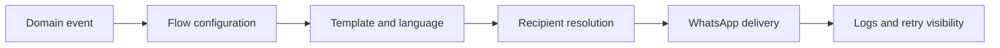

# Event-driven WhatsApp Bot

## Overview

The WhatsApp Bot is a configurable notification engine integrated into Rawabet. It converts logistics and financial lifecycle events into targeted messages for customers, drivers, administrators, and operational groups.

## Product capabilities

- Event catalogue covering orders, drivers, delivery, wallet, and transactions
- Configurable recipient types and administrative groups
- English and Arabic message templates with structured variables
- Per-flow activation and recipient controls
- Customer and internal alert variations
- Notification logs, failure visibility, and operational troubleshooting
- A visual focus view for managing event-to-recipient relationships

## My contribution

Event model, template design, recipient routing, administration interface, multilingual workflow design, testing, and integration with the Rawabet order lifecycle.

> The screenshot contains placeholder variables and a sandbox administration view; no customer messages or phone numbers are included.

