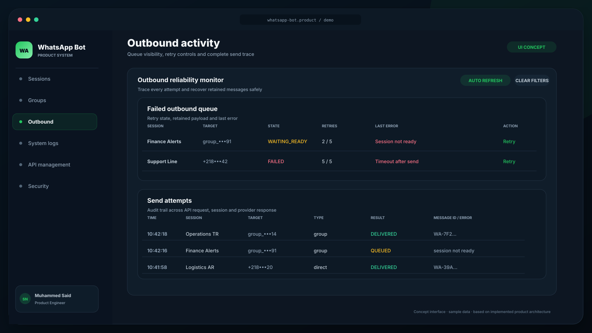
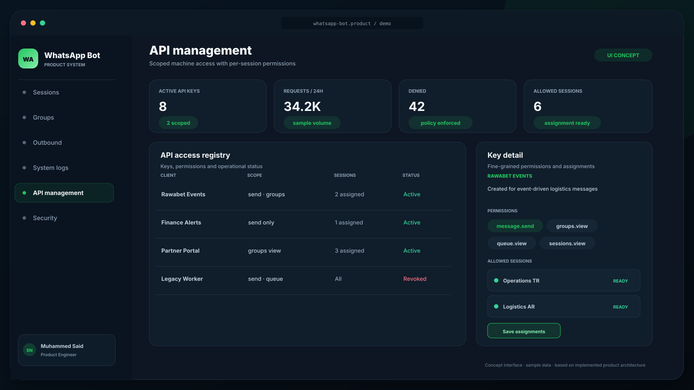
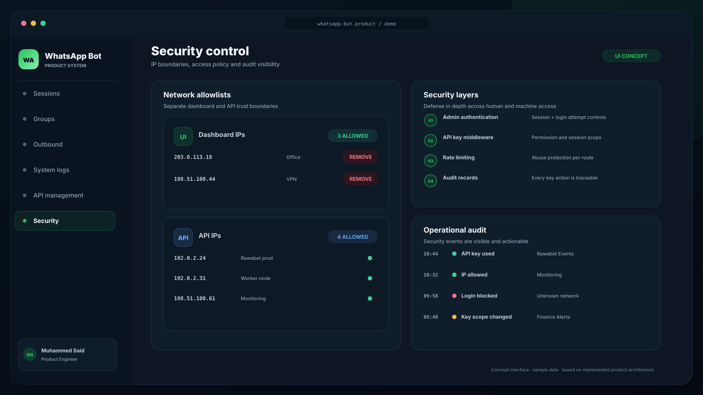
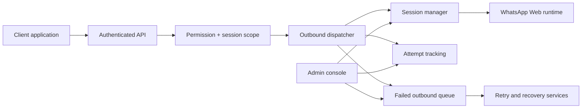

# WhatsApp Bot

[← Portfolio](../README.md)

A standalone, multi-session WhatsApp automation and delivery platform with its own administration console, API security model, outbound reliability layer, and operational controls.

**This is an independent product.** Rawabet can call it through an API, but the bot is not a module inside Rawabet and is designed to serve multiple clients and workflows.

> The interfaces below are original portfolio concepts based on the standalone repository’s dashboard, runtime services, data models, middleware, and queue behavior. All sessions, keys, phone fragments, IP addresses, groups, and message volumes are fictional sample data.

## 01 — Session command center

Each WhatsApp identity has an independent lifecycle: start, stop, QR onboarding, readiness, custom identifier, webhook configuration, and recovery settings. Socket events and periodic refresh keep the operator view current.

## 02 — Outbound reliability monitor

The outbound surface exposes both send attempts and failed-message queues. Operators can see session state, target, retry count, retained payload eligibility, errors, automated recovery, manual retry, and cleanup controls.

## 03 — API management

Machine access is managed as a product surface. API keys carry granular permissions, allowed session assignments, usage context, audit history, status, edit controls, and explicit revocation.

## 04 — Security control

Dashboard and API networks have separate allowlists. Authentication, API-key checks, permission scope, rate limiting, login-attempt controls, and audit records create layered protection for both people and integrations.

## Product surface

### Session and group operations

- Multiple isolated WhatsApp Web sessions
- QR authentication, runtime status, start/stop/restart, and session deletion
- Custom session identifiers, webhook endpoints, and recovery test targets
- Ready-session selection, group discovery, search, refresh, and safe group-ID copy

### Delivery reliability

- Direct and group messaging through an authenticated API
- Persistent outbound queue and attempt tracking
- Waiting-ready, retrying, completed, and terminal failure states
- Automatic retry, manual retry, payload-retention awareness, and recovery/canary checks
- System logs and audit context for troubleshooting

### Access and security

- Admin authentication and protected dashboard routes
- API-key creation, detail, editing, revocation, and usage statistics
- Granular permissions for sessions, messaging, groups, queues, logs, and key management
- Per-key session assignment
- Separate dashboard/API IP allowlists and rate limiting
- Login attempts, audit logs, and security event visibility

## System shape

The product uses a Node.js service layer, MongoDB persistence, a React/Vite administration console, WhatsApp Web/Puppeteer runtime, Socket.IO status events, queue/recovery services, and authentication/security middleware.

## Product engineering contribution

Standalone platform architecture, session and queue model, API design, permissions, administration interface, reliability workflows, audit/security controls, integration testing, deployment, and operations.

## What this case study demonstrates

- Separating a reusable messaging platform from one client product
- Designing failure recovery as a first-class operator workflow
- Giving machine identities explicit scope instead of a single shared secret
- Making session, queue, and security state observable
